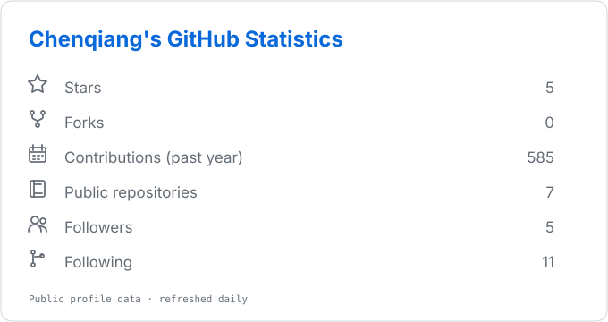
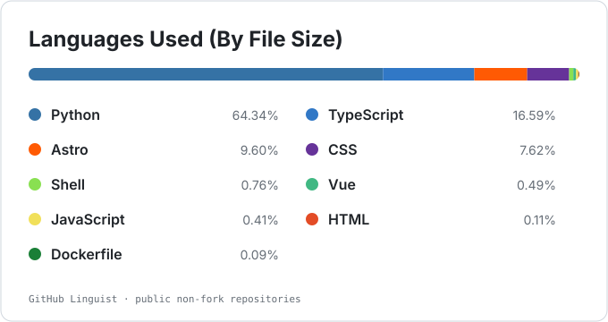

  

<h2 align="center">Hi, Chenqiang here.</h2>

  Graduate student in Osaka. Still learning.

  <a href="https://chenqiang-zhang.github.io/">Notes</a>
  ·
  <a href="https://github.com/Chenqiang-Zhang?tab=repositories">Repositories</a>

 

  <picture>
    <source media="(prefers-color-scheme: dark)" srcset="assets/overview-dark.svg" />
    <source media="(prefers-color-scheme: light)" srcset="assets/overview.svg" />
    
  </picture>
  <picture>
    <source media="(prefers-color-scheme: dark)" srcset="assets/languages-dark.svg" />
    <source media="(prefers-color-scheme: light)" srcset="assets/languages.svg" />
    
  </picture>

  Some days are green. Some days are for thinking.

